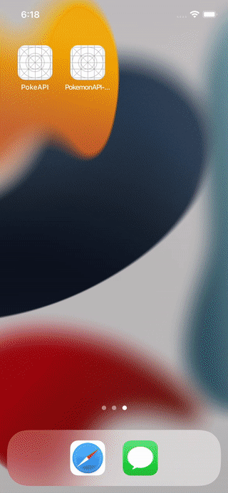

# PokeAPI

Implementations:
-
The main screen will then need to present with the Pokemon name and image. 
In detail screen, user should see a list of a minimum of six descriptions with info plus character image.

- [Implement PokeAPI](https://pokeapi.co/) 
- Swift
- MVVM
- URLSession
- Clean Architecture
- Unit Testing
- No Storyboards and no XIBs
- AutoLayout with Constraints
- Human Interface Guidelines
- Pagination
- Functional Reactive Programming (RxSwift)

How to run the project:
-
- This project was developed on Xcode 13.4 using Swift 5 . Please run pod install after cloning the repo and checking out to main for running the project.

Instructions:
-
- Swift 5
- Xcode 13.4

CocoaPods:
- 
- RxSwift
- RxCocoa
- RxDataSources
- Kingfisher
